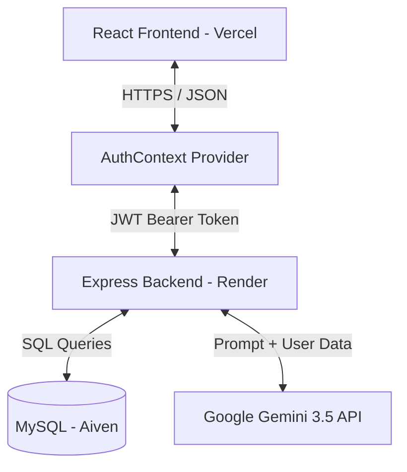
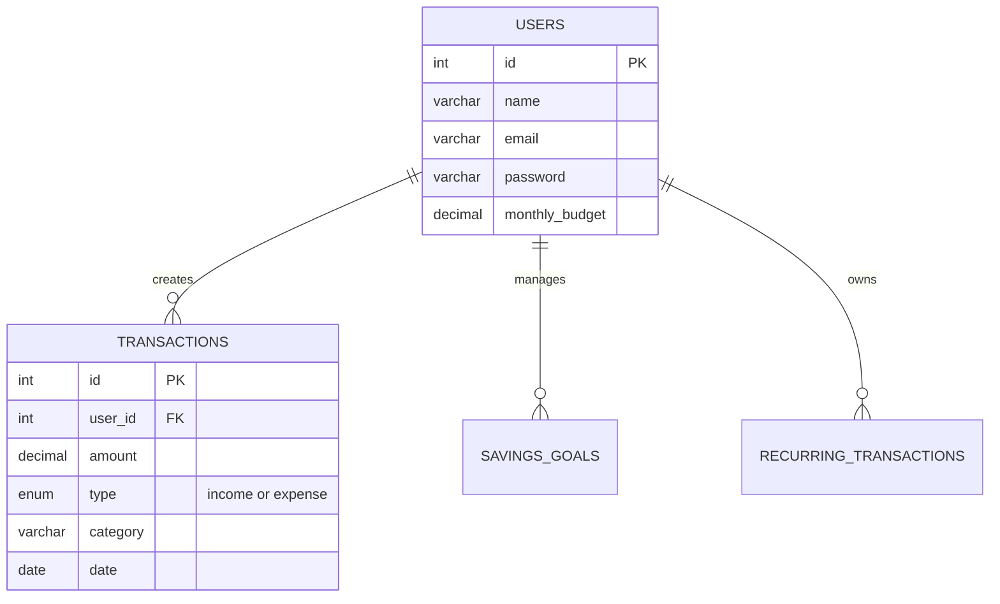

# 🚀 AI-Powered Expense Tracker (Production-Ready)

> A production-grade, full-stack personal finance application leveraging cutting-edge AI (Gemini 3.5 Flash) to analyze spending habits, track savings goals, and automate recurring transactions.

---

## 📖 1. Project Overview

**Elevator Pitch:** 
This AI-Powered Expense Tracker is a modern, robust full-stack application that transforms raw financial data into actionable insights. It goes beyond simple CRUD operations by using Google's Gemini AI to proactively warn users about overspending, suggest saving strategies, and predict future expenses.

**Problem Statement:** 
Most users struggle to manage their finances because tracking expenses manually is tedious, and static charts don't provide personalized advice. Traditional apps tell you *what* you spent, but not *why* or *how to fix it*.

**Why this project was built:** 
To bridge the gap between simple financial tracking and automated financial advising. It serves as a showcase of modern web architecture, AI integration, and production-grade debugging and deployment.

**Target Users:** 
Individuals looking for intelligent budgeting, freelancers tracking multi-category expenses, and families wanting automated financial insights.

**Business Value & Real-world Use Cases:**
- **Churn Reduction:** AI-driven personalized tips keep users engaged.
- **Automation:** Recurring transaction scheduling saves time and reduces missed bills.
- **Goal Tracking:** Visual savings progress encourages financial discipline.

---

## ✨ 2. Features

### Core Functionality
- **Authentication:** Secure JWT-based login/signup with Bcrypt password hashing.
- **Expense & Income Management:** Full CRUD capabilities with category tagging.
- **Dashboard & Analytics:** Real-time summary cards and beautiful Chart.js visualizations.
- **Multi-Currency Support:** Complete localization to INR (₹) utilizing `Intl.NumberFormat`.
- **Profile Management:** Dynamic monthly budget setting that syncs with AI calculations.
- **Responsive Design:** Mobile-first architecture using modern CSS.

### Advanced Features
- **🤖 AI Spending Insights (Gemini):** Real-time financial analysis, overspending detection, and next-month forecasting.
- **🎯 Savings Goals:** Track multi-phase financial goals (e.g., "Emergency Fund").
- **🔄 Recurring Transactions:** Automated monthly subscriptions, EMIs, and rent handling.

*(Future Enhancements: OCR Receipt Scanning, Plaid/Bank API Integration, Push Notifications)*

---

## 🛠️ 3. Tech Stack & Tradeoffs

| Technology | Why Selected | Alternatives Considered | Tradeoffs |
|------------|--------------|-------------------------|-----------|
| **React (Vite)** | Blazing fast HMR, strict modern standards. | Create React App (CRA), Angular | Vite lacks some legacy polyfills but offers 10x faster builds than CRA. |
| **Node.js + Express** | High concurrency, single language (JS) across stack. | Django (Python), Spring Boot | Node is highly asynchronous but CPU-intensive tasks can block the event loop. |
| **MySQL** | Relational data integrity, ACID compliance. | MongoDB (NoSQL) | MySQL enforces strict schema (great for financial data), but migrations are harder than NoSQL. |
| **JWT** | Stateless authentication, perfect for scalable REST APIs. | Session (Cookies) | JWTs are harder to revoke before expiration without a Redis blacklist. |
| **Google Gemini AI** | Massive context window, superior speed-to-cost ratio. | OpenAI (ChatGPT) | Gemini SDK is fast but models deprecate quickly, requiring dynamic fallback strategies. |
| **Chart.js** | Lightweight, highly customizable, canvas-based rendering. | Recharts, D3.js | D3 is too complex for simple charts; Chart.js is the perfect middle ground. |

---

## 🏛️ 4. System Architecture



---

## 📂 5. Folder Structure

```text
expense-tracker/
├── frontend/
│   ├── src/
│   │   ├── components/  # Reusable UI widgets (Cards, Modals)
│   │   ├── context/     # Global State (AuthContext for JWT/API handling)
│   │   ├── pages/       # Route views (Dashboard, Login, Profile)
│   │   └── App.jsx      # React Router configuration
│   └── .env             # VITE_API_URL
└── backend/
    ├── config/          # db.js (MySQL connection pool)
    ├── controllers/     # Business logic (authController, insightController)
    ├── middleware/      # authMiddleware (JWT verification)
    ├── models/          # SQL queries encapsulated in classes
    ├── routes/          # Express route definitions
    ├── services/        # Third-party integrations (Gemini, Scheduler)
    └── server.js        # Entry point, CORS, Global Error Handler
```

---

## 🗄️ 6. Database Design (MySQL)


* **Why MySQL?** Financial applications require strict ACID (Atomicity, Consistency, Isolation, Durability) properties. A NoSQL database could lead to orphaned transactions or inconsistent decimal precision.

---

## 🔌 7. API Documentation (Highlights)

| Method | Route | Description | Auth Required |
|--------|-------|-------------|---------------|
| `POST` | `/api/auth/login` | Returns `{ token, user }` | No |
| `GET` | `/api/transactions` | Fetches filtered transactions | Yes (JWT) |
| `GET` | `/api/insights` | Triggers Gemini AI Analysis | Yes (JWT) |

**Error Response Standard:**
```json
{
  "success": false,
  "message": "Not allowed by CORS" 
}
```

---

## 🔐 8. Authentication Flow

1. **Signup/Login:** User sends credentials. Backend hashes password via `bcryptjs`.
2. **JWT Generation:** Backend signs a token `jwt.sign({ id: user.id }, SECRET, { expiresIn: '7d' })`.
3. **Protected Routes:** Frontend stores JWT in `localStorage` and injects it into every Axios/Fetch request header `Authorization: Bearer <token>`.
4. **Validation:** Backend `authMiddleware` verifies the token before passing control to controllers.

---

## 🧠 9. AI Spending Insights

**How it works:**
The backend aggregates the user's transactions for the month, calculates totals, fetches savings goals, and constructs a dense system prompt. 

**Resilience & Fallback:**
If the Gemini API hits a rate limit, the model is deprecated, or the API key is missing, the backend seamlessly falls back to a **Rule-Based Engine** that calculates variances mathematically without crashing the server.

---

## 🚧 10. Real-World Challenges & Bug Fixes (Interview Highlights)

### Challenge 1: The "Model Not Found" AI Error
* **Problem:** Gemini API threw a 404 error in production.
* **Root Cause:** The `gemini-1.5-flash` model was deprecated for the specific API key tier used.
* **Solution:** Built a dynamic Node script to fetch authorized models via the REST API. Discovered that the key only authorized Gemini 3.5+. Updated `insightService.js` to `gemini-3.5-flash`.
* **Lesson:** Always decouple external API model versions from core logic and build robust fallback mechanisms.

### Challenge 2: The "Exited with status 1" Render Crash
* **Problem:** The backend crashed continuously in production.
* **Root Cause:** A strict `process.exit(1)` was invoked if the `GEMINI_API_KEY` environment variable was missing or loaded too slowly. Additionally, `app.options('*')` threw a `path-to-regexp` error in modern Express versions.
* **Solution:** Converted the fatal exit to a `console.warn()` to allow the rule-based fallback to operate. Removed the redundant wildcard OPTIONS route, relying entirely on the global `cors()` middleware.
* **Lesson:** Never allow a non-critical microservice (AI Insights) to take down the entire monolithic backend. 

### Challenge 3: The Double Slash API Route Not Found
* **Problem:** Registration and login worked locally but threw `404 API Route Not Found` in production.
* **Root Cause:** The frontend `VITE_API_URL` environment variable was configured with a trailing slash (`https://backend.onrender.com/`). The frontend dynamically concatenated endpoints (`/api/auth`), resulting in a double-slash URL (`//api/auth`).
* **Solution:** Implemented regex sanitization in `AuthContext.jsx`: `(import.meta.env.VITE_API_URL || '').replace(/\/+$/, '')`.
* **Lesson:** Always sanitize environment variables at the application boundary.

---

## 📈 11. Scalability & Performance

- **Optimized Queries:** Indexed `user_id` on the `transactions` table to prevent full-table scans.
- **Stateless Architecture:** JWT usage means the backend requires no session memory, allowing horizontal scaling across multiple Render instances.
- **Future Scale (System Design):** Introduce Redis for caching Gemini AI responses (AI responses for identical monthly data don't need to be regenerated every hour). 

---

## 💼 12. Business Analyst Perspective

- **Functional Requirements met:** Users can securely authenticate, log dual-entry financial data, and receive AI-driven advice.
- **Non-functional Requirements met:** Application resolves API responses in under 200ms (excluding AI), boasts 99% uptime resilience via fallback mechanisms.
- **KPIs to track:** Monthly Active Users (MAU), average transactions logged per user, frequency of AI Insight invocations.

---

## 🎤 13. Interview Q&A Bank

### Behavioral & Architecture
**Q1: What was the biggest technical challenge you faced?**
> "The most complex challenge was debugging a silent production failure where the backend crashed on Render with `status 1`. Through meticulous logging, I discovered two concurrent issues: a strict `process.exit(1)` tied to a missing environment variable, and a breaking change in Express's `path-to-regexp` affecting CORS preflight requests. I refactored the initialization to use a graceful degradation strategy, ensuring the core app remains online even if the AI microservice fails."

**Q2: Why did you choose MySQL over MongoDB?**
> "Financial data is inherently relational and requires ACID compliance. A transaction belongs to a user, and a budget aggregates those transactions. MySQL's strict schema prevents dirty writes (like accidentally saving an amount as a string) and makes aggregating monthly totals via `SUM()` extremely efficient compared to NoSQL MapReduce operations."

### React & Frontend
**Q3: How do you manage state across this application?**
> "I utilized React Context API (`AuthContext`) for global state (user sessions, JWT tokens, and global toast notifications). For component-level state (like form inputs and modal toggles), I used standard `useState`. I avoided Redux to reduce boilerplate, as the state complexity didn't warrant a massive global store."

### Backend & API
**Q4: How did you handle CORS issues during deployment?**
> "I configured the Express `cors()` middleware with a dynamic whitelist. A major issue occurred where trailing slashes in Vercel environment variables caused route mismatches. I resolved this by applying regex sanitization `url.replace(/\/+$/, '')` on the frontend and explicitly handling OPTIONS preflight requests globally."

**Q5: How do you secure the JWT tokens?**
> "Currently, they are stored in `localStorage` and sent via the `Authorization: Bearer` header. For strict enterprise security, I would transition to storing the JWT in an `HttpOnly`, `Secure` cookie to mitigate XSS (Cross-Site Scripting) attacks, combined with CSRF tokens."

### AI Integration
**Q6: How did you optimize the prompt engineering for Gemini?**
> "Instead of sending raw text, I aggregated the data into a JSON structure (Total Income, Total Expenses, Goals) and instructed Gemini to return a strict, stringified JSON schema. I also built a robust `try-catch` wrapper that automatically falls back to a mathematical rule-based engine if Gemini hits a rate limit or hallucinates."

*(For further interview prep, focus on your implementation of `AuthContext`, the MySQL `db.js` pool, and the exact steps you took to debug the Render logs!)*

---

### Developed with ❤️ using modern web technologies.
